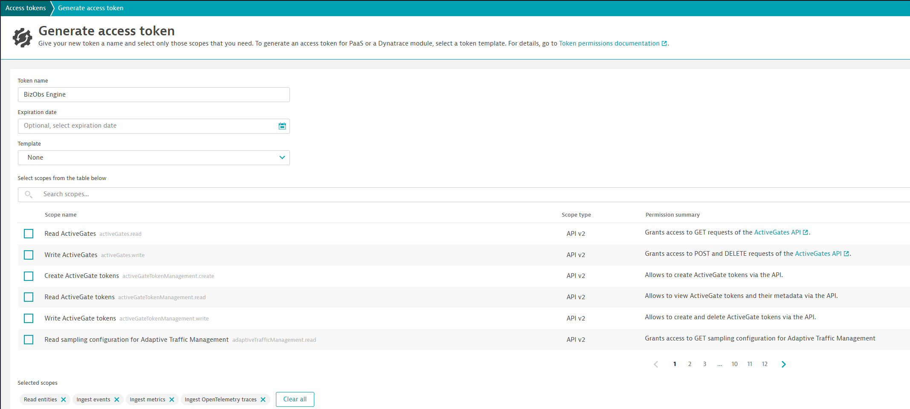
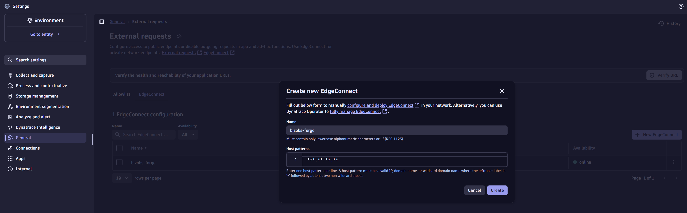
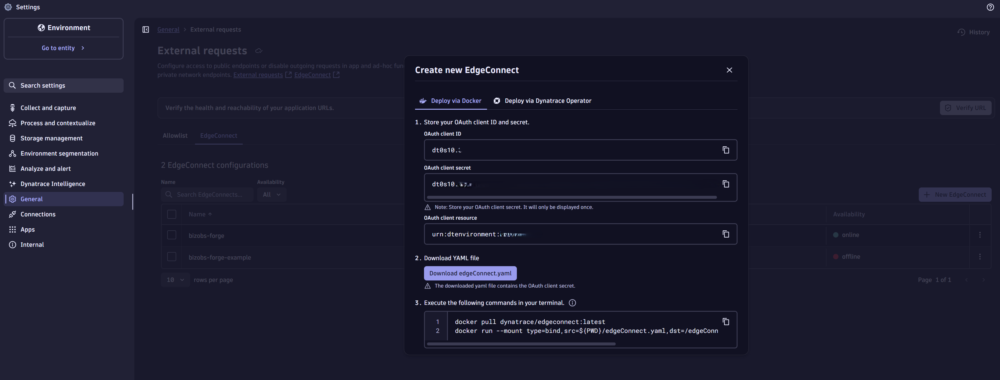
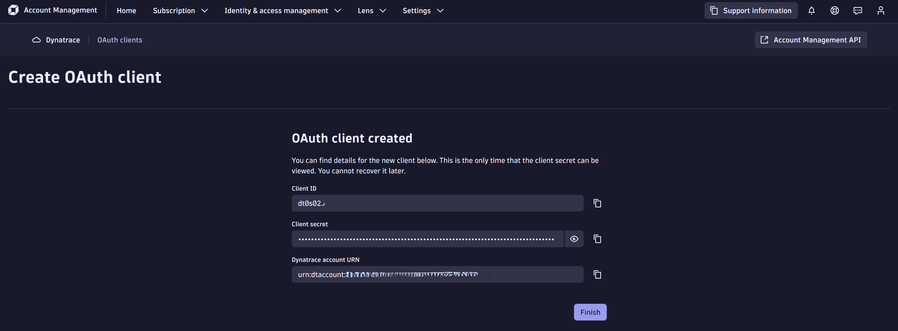
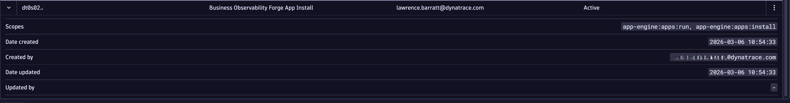
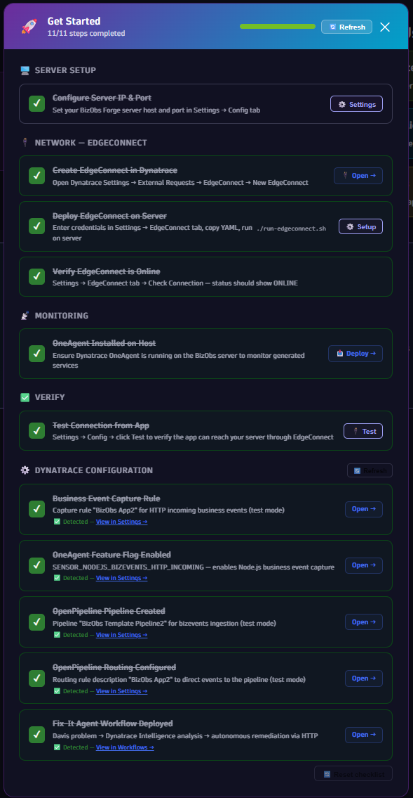
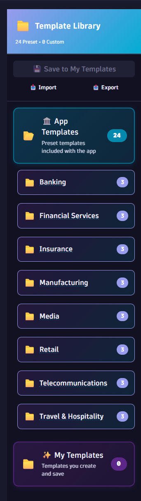

# Technical Guide — Business Observability Demonstrator (v2.23.1)

> A hands-on guide for engineers, SEs, and developers who want to get the platform running and understand what's under the hood.

> **Want the fast path?** Just run `./setup.sh` — it walks you through 6 guided prompts and does everything automatically. This guide explains what the script does and how to do it manually.

---

## What Is This?

The Business Observability Demonstrator is a two-part system:

1. **The Demonstrator** — A Node.js server that dynamically spawns microservices, simulates customer journeys, and runs AI agents for chaos injection and auto-remediation.
2. **The Demonstrator UI** — A Dynatrace AppEngine app (React + Strato) that gives you a single-pane-of-glass inside Dynatrace to control everything.

The Demonstrator runs on your host (EC2, VM, Codespace). The Demonstrator UI runs inside Dynatrace and talks to the Demonstrator through an **EdgeConnect** tunnel.

---

## Architecture Overview

```
┌──────────────────────────────────────────────────────────────────┐
│                    Dynatrace Platform                            │
│                                                                  │
│  ┌──────────────────────────┐   ┌───────────────────────────┐    │
│  │  Business Observability  │   │  Services / BizEvents /   │    │
│  │  Demonstrator UI (AppEngine)    │   │  Dashboards / Problems    │    │
│  └──────────┬───────────────┘   └───────────────────────────┘    │
│             │ EdgeConnect Tunnel                  ▲              │
│             │ (HTTPS → port 8080)                 │ OneAgent +   │
│             │                                     │ OTLP         │
└─────────────┼─────────────────────────────────────┼──────────────┘
              │                                     │
              ▼                                     │
┌──────────────────────────────────────────────────────────────────┐
│  Your Host (EC2 / VM / Codespace)                                │
│                                                                  │
│  ┌──────────────────────────────────────────────────────────┐    │
│  │  Main Server (port 8080) — Express.js + Socket.IO        │    │
│  │  ├── 20+ API route modules (100+ endpoints)              │    │
│  │  ├── AI Agents: Nemesis (chaos), Fix-It (remediation),   │    │
│  │  │     Librarian (memory/audit), Dashboard (BI deploy)   │    │
│  │  ├── Feature Flag Manager (per-service isolation)        │    │
│  │  ├── Journey Simulation Engine                           │    │
│  │  ├── MCP Server + PDF Export + Workflow Webhooks         │    │
│  │  └── Dynatrace Event Ingestion + DT API Proxy            │    │
│  └──────────────────────────────────────────────────────────┘    │
│                          │                                       │
│              spawns child processes (with --require otel.cjs)   │
│                          ▼                                       │
│  ┌──────────────────────────────────────────────────────────┐    │
│  │  Dynamic Child Services (ports 8081–8740, 660 ports)     │    │
│  │  Each = separate Node.js process with:                   │    │
│  │  ├── Own Express server + /health endpoint               │    │
│  │  ├── OpenTelemetry auto-instrumentation (otel.cjs)       │    │
│  │  ├── Dynatrace OneAgent identity (unique DT_TAGS)        │    │
│  │  ├── Per-service feature flags from main server          │    │
│  │  └── Service-to-service call chaining                    │    │
│  └──────────────────────────────────────────────────────────┘    │
│                                                                  │
│  ┌────────────────┐  ┌───────────┐  ┌────────────────────┐       │
│  │  EdgeConnect   │  │  OneAgent │  │  Ollama (LLM)      │       │
│  │  (tunnel)      │  │           │  │  llama3.2          │       │
│  └────────────────┘  └───────────┘  └────────────────────┘       │
└──────────────────────────────────────────────────────────────────┘
```

---

## Prerequisites

Before you start, make sure you have **all of these** ready:

| # | Component | Version | Why You Need It | How To Check |
|---|-----------|---------|-----------------|--------------|
| 1 | **Dynatrace Tenant** | Sprint or Managed | Receives all telemetry | You should have a `*.sprint.dynatracelabs.com` or `*.live.dynatrace.com` URL |
| 2 | **Dynatrace API Token** | — | Engine sends events to DT | Create in DT: Settings → Access Tokens → Generate. Scopes: `events.ingest`, `metrics.ingest`, `openTelemetryTrace.ingest`, `entities.read` |
| 3 | **OAuth Client(s)** | — | EdgeConnect + app deploy | Create in DT: Settings → General → External Requests → Add EdgeConnect. It generates the OAuth creds. Optionally add deploy scopes or use a separate client. |
| 4 | **EC2 / VM / Host** | Linux recommended | Runs the Demonstrator server | SSH access, ports 8080–8200 open in Security Group (inbound not strictly required — EdgeConnect tunnels inbound) |
| 5 | **Node.js** | v22+ (v24 recommended) | Server runtime | `node --version` → should show v22.x+ |
| 6 | **Docker** | Latest | Runs EdgeConnect | `docker --version` |
| 7 | **Dynatrace OneAgent** | Latest | Auto-instruments every child service | `sudo systemctl status oneagent` or check Hosts in DT UI |
| 8 | **Ollama** | Latest | Powers AI agents (Nemesis, Fix-It, Librarian) | `ollama list` → should show `llama3.2` |

> **Don't have a Dynatrace API Token yet?** Stop here and create one. Nothing will work without it.

---

## Getting Started

Follow these steps **in order**. Each step depends on the one before it.

```
Step 1: Clone & Install            ← Get the code (single unified repo)
Step 2: Create DT Credentials      ← A: API Token  +  B: OAuth Client (2 things to create in DT)
Step 3–5: ./setup.sh               ← Handles EdgeConnect, app deploy, build, and server start
Step 6: Configure from Demonstrator UI    ← Wire everything together (private IP + Get Started checklist)
```

> **Shortest path:** Do Steps 1–2, then just run `./setup.sh` — it walks you through 6 guided prompts and does Steps 3–5 automatically.

---

### Step 1: Clone & Setup

This is a **single unified repo** — it contains both the Demonstrator (server) and the Demonstrator UI (AppEngine app).

```bash
sudo git clone https://github.com/LawrenceBarratt90/Business-Observability-Demonstrator.git
cd Business-Observability-Demonstrator
chmod +x setup.sh
sudo ./setup.sh
```

The `setup.sh` script will walk you through 6 guided prompts and handle everything automatically: npm install, credential configuration, EdgeConnect setup, AppEngine deploy, and server startup.

**Verify:** The script ends with a green "All done" message and the server running on port 8080.

---

### Step 2: Create Dynatrace Credentials

You need **2–3 credentials** — an API Token, an EdgeConnect OAuth Client, and optionally a separate Deploy OAuth Client:

| # | Credential | Type | Where To Create | What Uses It |
|---|-----------|------|----------------|---------------|
| A | **API Token** | `dt0c01.*` | Dynatrace tenant → Settings → Access Tokens | The **Demonstrator server** uses this to send events/metrics to Dynatrace |
| B | **EdgeConnect OAuth** | `dt0s10.*` or `dt0s02.*` | Dynatrace tenant → Settings → General → External Requests → EdgeConnect | **EdgeConnect** (tunnel). Can also be used for deploy if you add the right scopes. |
| C | **Deploy OAuth**  | `dt0s10.*` or `dt0s02.*` | Separate client from Account Management → IAM → OAuth clients | **`dt-app deploy`** (app deployment to Dynatrace AppEngine) |

> **Simplest setup:** Use **one OAuth client** (B) for both EdgeConnect and deploy by adding deploy scopes to it. `setup.sh` will ask if you want to use the same or a different client.

---

#### Credential A: API Token (for the Demonstrator server)

**Create it in Dynatrace:**
1. Go to your Dynatrace tenant
2. Settings → Access Tokens → **Generate new token**
3. Name: `BizObs Demonstrator`
4. Add these scopes:
   - `events.ingest`
   - `metrics.ingest`
   - `openTelemetryTrace.ingest`
   - `entities.read`
5. Click **Generate** → **copy the token** (you can't see it again)
> 📸 **Screenshot: Access Tokens Page** 

> **You don't need to save this to a file.** `setup.sh` will ask for this token and create `.dt-credentials.json` automatically.

---

#### Credential B: EdgeConnect OAuth Client

This client is used for the EdgeConnect tunnel. Depending on your tenant, it may generate a `dt0s10.*` (environment-level) or `dt0s02.*` (account-level) client.

**Create it in Dynatrace:**
1. Go to your Dynatrace tenant
2. **Settings → General → External Requests**
3. Click **Add EdgeConnect** (or select an existing one)
4. Name it (e.g. `bizobs-demonstrator`) — **remember this name, it must match what the script generates**
5. DT will generate the OAuth credentials for you and show:
   - **OAuth client ID**: `dt0s10.XXXXX` or `dt0s02.XXXXX`
   - **OAuth client secret**: shown only once!
   - **OAuth client resource**: `urn:dtenvironment:YOUR_TENANT_ID`
6. **Click "Download edgeConnect.yaml"** — this gives you a pre-filled YAML with all the values





> **Important:** The client secret is only shown once. Copy it or download the YAML immediately.

**Optionally, make this same client work for deploy too:**
1. Go to **Account Management** → **Identity & Access Management** → **OAuth clients**
2. Click **Create Client**
3. Input your **email address** and the description **Business Observability Demonstrator App Install**
4. **Add these scopes**:
   - `app-engine:apps:install` (required to deploy the app)
   - `app-engine:apps:run` (required to run the app)
5. Save




> **If you can't add deploy scopes** (e.g. the client type doesn't allow it), use a separate account-level OAuth client for deploy. `setup.sh` will ask at prompt 6/6.

---

### Steps 3–5: Deploy Everything

> **Using `setup.sh`?** It handles all of this automatically. The steps below are only needed if you're doing a manual setup.

<details>
<summary><strong>Manual Steps 3–5 (click to expand — not needed if you ran setup.sh)</strong></summary>

If you prefer to do things manually instead of `./setup.sh`:

```bash
# 1. Copy the EdgeConnect YAML downloaded from DT External Requests page
#    (or edit edgeconnect/edgeConnect.yaml with your OAuth client values)
cp ~/Downloads/edgeConnect.yaml edgeconnect/edgeConnect.yaml

# 2. Start EdgeConnect tunnel
bash edgeconnect/run-edgeconnect.sh

# 3. Deploy Demonstrator UI (setup.sh passes creds automatically;
#    for manual deploy, re-run: ./setup.sh)
npx dt-app deploy

# 4. Build agents & start server
npm run build:agents
npm start
```

> **Note:** `npx dt-app deploy` requires OAuth credentials in the environment. The easiest way is to run `./setup.sh` which sets them automatically. If you must deploy manually, export the deploy credentials:
> ```bash
> source setup.conf
> export DT_APP_OAUTH_CLIENT_ID="$DEPLOY_OAUTH_CLIENT_ID"
> export DT_APP_OAUTH_CLIENT_SECRET="$DEPLOY_OAUTH_CLIENT_SECRET"
> npx dt-app deploy
> ```

</details>

**Verify:**
```bash
curl http://localhost:8080/api/health
```

You should get:
```json
{"status":"ok","timestamp":"...","mainProcess":{"pid":...,"uptime":...,"port":8080},"childServices":[]}
```

The `childServices` array is empty — that's correct. **No services are spawned by default.** The server sits idle until you launch a journey from the Demonstrator UI.

> **Want it to run in the background?** Use:
> ```bash
> nohup npm start > server.log 2>&1 &
> echo $! > server.pid
> ```
> Or set it up as a systemd service for auto-restart on reboot.

---

### Step 6: Configure from the Demonstrator UI

Open the Demonstrator app in Dynatrace (**Apps → Business Observability Demonstrator**).

**6a. Go to Settings (gear icon) → Config tab:**

| Field | Value | Example |
|-------|-------|---------|
| Protocol | `HTTP` | (not HTTPS — the server runs plain HTTP) |
| Host / IP Address | Your **private IP** | `***.**.**.**` |
| Port | `8080` | |

Click **Save**, then click **Test**.


> **If the test fails:**
> - Make sure the Demonstrator server is running (Step 5)
> - Make sure EdgeConnect is running and connected (Step 3c)
> - Make sure you're using the **private IP**, not the public Elastic IP
> - Wait 15 seconds and try again (EdgeConnect routing can take a moment to propagate)

**6b. Go to Settings → EdgeConnect tab:**

If EdgeConnect is already running (Step 3), you should see a green "EdgeConnect Connected" status. The host pattern should show your **private IP**.

If it shows your public IP, click the EdgeConnect tab and update the **Host Pattern / Server IP** to your private IP.

**6c. Go to Settings → Get Started tab:**

This is a checklist that auto-detects your setup and lets you deploy Dynatrace configuration with one click per step:

| Step | What It Does | What To Do |
|------|-------------|------------|
| **Configure Server IP** | Set the IP/hostname of your engine server | Should be green if you did 7a |
| **Create EdgeConnect** | Registers EdgeConnect config in Dynatrace | Should be green if you did Step 3 |
| **Deploy EdgeConnect** | Instructions for running EdgeConnect on your host | Should be green if EdgeConnect is up |
| **Verify EdgeConnect Online** | Polls DT to confirm tunnel is active | Should be green if Step 3c passed |
| **OneAgent Installed** | Verifies OneAgent is reporting from your host | Green if OneAgent is running |
| **Test Connection** | Pings the engine through the EdgeConnect tunnel | Click to test — should go green |
| **OpenPipeline Pipeline** | Creates the BizEvents processing pipeline | Click **Deploy** |
| **OpenPipeline Routing** | Configures routing rules for business events | Click **Deploy** |
| **Business Event Capture Rule** | Deploys capture rules for OneAgent | Click **Deploy** |
| **OneAgent Feature Flags** | Enables required OneAgent feature flags | Click **Deploy** |

Work through from top to bottom. Each green checkmark means that step is configured correctly.


**Once all steps are green, you're ready.** Go to the **Home** tab, pick a template from the Template Library, and click **Run** to launch your first journey simulation.

---

## How It Works

### Journey Simulation Flow

```
1. User picks a template (e.g. "Healthcare Provider — Patient Care Journey")
   or enters custom company details
                    │
                    ▼
2. Engine spawns child services (one per journey step)
   e.g. PatientRegistrationService (port 8081)
        TriageAndAssessmentService (port 8082)
        ClinicalConsultationService (port 8083)
        ...
                    │
                    ▼
3. Auto-load generates continuous traffic
   - Random customer profiles
   - Realistic timing between steps
   - OneAgent captures each request as a bizevent
                    │
                    ▼
4. Dynatrace sees:
   - Services in Smartscape topology
   - Business events in BizEvents
   - Traces with full distributed context
   - Custom properties (company, industry, step, revenue, etc.)
```

### The Template Library

110+ pre-built industry journey templates across 55+ verticals in 11 categories:

| Category | Verticals |
|----------|----------|
| **Financial Services** | Banking, Insurance, Financial Services, Payments |
| **Healthcare & Life Sciences** | Healthcare, Pharmaceuticals, Veterinary |
| **Technology** | Cybersecurity, Data Centre, Gaming, Robotics, Semiconductor, Social Media |
| **Retail & Consumer** | Retail, Fashion, Beauty, Food & Beverage, Marketplace |
| **Energy & Utilities** | Energy, EV, Water, Waste, Mining |
| **Transport & Logistics** | Airlines, Logistics, Shipping, Rail, Ride-Hailing, Delivery |
| **Manufacturing & Industrial** | Manufacturing, Industrial, Chemical, Construction |
| **Media & Entertainment** | Media, Music, Publishing, Sports, Lottery |
| **Professional Services** | Consulting, Legal, HR, Advertising, Nonprofit |
| **Government & Public** | Government, Defence, Smart City, ESG |
| **Real Estate & Hospitality** | Real Estate, Hospitality, Space, Agriculture, Fitness |

Each vertical includes 2 pre-built demo journeys. Each template includes: company name, domain, industry type, journey steps with substeps, business metadata (revenue, category, KPIs), and customer profiles.




### Per-Service Chaos Injection

Chaos is injected through **feature flags**, not by killing processes:

```
┌──────────────────────┐     GET /api/feature_flag?service=X     ┌─────────────┐
│  Child Service       │ ──────────────────────────────────────► │ Main Server │
│  (port 8082)         │ ◄────────────────────────────────────── │ (port 8080) │
│                      │     { errors_per_transaction: 0.8 }     │             │
│  if (Math.random()   │                                         │ Feature     │
│    < errorRate)      │                                         │ Flag Store  │
│    throw Error()     │                                         └─────────────┘
└──────────────────────┘
```

The Nemesis agent (Nemesis) sets error rates on specific services. Each service polls its own flags from the main server. Only the targeted service sees elevated errors — everything else stays healthy.

7 chaos recipes:
- `enable_errors` — Set error rate (10%–100%)
- `increase_error_rate` — Ramp up existing errors
- `slow_responses` — Add latency
- `disable_circuit_breaker` — Remove resilience
- `disable_cache` — Force cache misses
- `target_company` — Target all services for one company
- `custom_flag` — Set any arbitrary flag

### AI Agent Architecture

```
┌─────────────┐    injects chaos    ┌────────────────┐
│  Nemesis     │ ──────────────────► │ Feature Flags  │
│  (Chaos)     │                     │ (per-service)  │
└──────┬───────┘                     └────────────────┘
       │ records to                          │
       ▼                                     │ errors propagate
┌─────────────┐                              ▼
│  Librarian   │ ◄─── records ────── ┌────────────────┐
│  (Memory)    │                     │ Dynatrace      │
└──────┬───────┘                     │ (Problems,     │
       │ provides context            │  BizEvents)    │
       ▼                             └───────┬────────┘
┌─────────────┐    queries DT API            │
│  Fix-It      │ ◄──────────────────────────┘
│  (Remediate) │
│              │ ── resets flags ──► Feature Flags
│              │ ── sends event ──► Dynatrace
└──────────────┘
```

All agents use **LLM function calling** (via Ollama) to decide what actions to take. The Librarian provides persistent memory so agents can learn from past incidents.

#### Librarian Dashboard

The Librarian agent also powers the **Librarian Dashboard** — a modal overlay on the Demonstrator Dashboards page (📚 button). When opened, it:

1. Fetches all history events and vector store stats from the backend
2. Sends the condensed timeline to Ollama for SRE-style analysis (with a 65-second `Promise.race` timeout)
3. Renders: AI Summary, colour-coded Stats Cards, severity-tagged Insights, Detected Patterns, and a scrollable Event Timeline
4. Falls back to raw-data analysis when Ollama is cold or unavailable

Backend endpoints: `GET /api/librarian/history`, `GET /api/librarian/stats`, `POST /api/librarian/analyze`.

### Dynatrace Event Ingestion

Every chaos injection and remediation action sends a `CUSTOM_DEPLOYMENT` event to Dynatrace:

```json
{
  "eventType": "CUSTOM_DEPLOYMENT",
  "title": "💥 Chaos Injection: enable_errors on CheckInAndRegistrationService",
  "entitySelector": "type(SERVICE),entityName.contains(\"CheckInAndRegistrationService\")",
  "properties": {
    "change.type": "chaos-injection",
    "chaos.id": "chaos-1772608582260-3",
    "chaos.type": "enable_errors",
    "chaos.target": "CheckInAndRegistrationService",
    "deployment.source": "nemesis-agent",
    "dt.event.is_rootcause_relevant": "true"
  }
}
```

These events appear as deployment markers on the affected service in Dynatrace, enabling root cause correlation with Dynatrace Intelligence.

---

## Key API Endpoints

| Endpoint | Method | Purpose |
|----------|--------|---------|
| `/api/health` | GET | Server health + child service list |
| `/api/journey-simulation/simulate-journey` | POST | Launch a journey simulation |
| `/api/admin/services/status` | GET | All service statuses |
| `/api/admin/services/restart-all` | POST | Restart all core services |
| `/api/gremlin/inject` | POST | Inject chaos into a service |
| `/api/gremlin/active` | GET | List active chaos faults |
| `/api/gremlin/revert/:faultId` | POST | Revert a specific fault |
| `/api/gremlin/revert-all` | POST | Revert all active faults |
| `/api/feature_flag` | GET/POST | Read/set feature flags |
| `/api/nemesis/*` | POST | Nemesis AI agent endpoints |
| `/api/fixit/*` | POST | Fix-It AI agent endpoints |
| `/api/librarian/*` | GET/POST | Librarian memory endpoints |
| `/api/librarian/analyze` | POST | Ollama-powered history analysis (Librarian Dashboard) |
| `/api/ai-dashboard/*` | POST | AI-generated DQL dashboard deployment |
| `/api/pdf/*` | POST | PDF export of dashboards |
| `/api/mcp/*` | Various | MCP (Model Context Protocol) server endpoints |
| `/api/autonomous/*` | POST | Autonomous agent orchestration |
| `/api/workflow-webhook/*` | POST | Dynatrace workflow webhook receiver |
| `/api/business-flow/*` | GET/POST | Business flow configuration |
| `/api/dt-proxy/*` | GET | Proxy to Dynatrace APIs |

---

## Demonstrator UI Pages (AppEngine)

The Dynatrace AppEngine app has 8 routes:

| Page | Route | Purpose |
|------|-------|---------|
| **Home** | `/` | Welcome, Get Started wizard, Template Library, Journey Builder, Active Journeys, Nemesis Chaos modal |
| **Services** | `/services` | Live service dashboard with start/stop controls per company (accessible via direct URL) |
| **Chaos Control** | `/chaos` | Select a service, pick a chaos type, inject — with live active faults list |
| **Fix-It Agent** | `/fixit` | Trigger automated diagnosis and remediation |
| **Demonstrator Dashboards** | `/demonstrator-dashboards` | DQL-powered dashboard presets (Security, DI, Infra, etc.) + Librarian modal overlay for AI-driven incident analysis |
| **Settings** | `/settings` | Configure server IP, API tokens, EdgeConnect credentials |
| **Demo Guide** | `/demo-guide` | Interactive walkthrough paths for demos (Quick Start, Chaos & Fix-It, Traces, Platform, LiveDebugger) |
| **Solutions** | `/solutions` | 55+ industry verticals with Dynatrace capability mapping, clickable demo journeys |

> **Note:** The primary navigation is the Home page with 3 tabs: Welcome, Customer Details, Generate Prompts. Chaos control is also accessible via the Nemesis modal on the Home page. Active Journeys shows running services and their status.

> 📸 **Screenshot: Chaos Control Page** — *The Demonstrator UI Chaos Control page showing: the service selector dropdown with a healthcare service selected, the chaos type picker (enable_errors, slow_responses, etc.), the intensity slider, and below it the "Active Faults" list showing one or two injected faults with their target service, type, and a "Revert" button.*

### Home Page Flow

```
Welcome Tab → Step 1: Company Details → Step 2: Generate Prompts → Step 3: Run Simulation
     │
     ├── Template Library sidebar (left panel)
     │   ├── 110+ pre-built industry templates (55+ verticals)
     │   ├── Search/filter by industry
     │   ├── Click to load → auto-populates all fields
     │   ├── Export/Import configs (JSON)
     │   └── Save custom configs
     │
     └── Get Started checklist (persisted to DT settings)
         ├── Auto-detects EdgeConnect, OneAgent, OpenPipeline status
         ├── One-click Deploy buttons for each DT config
         └── Progress tracked across sessions
```

---

## Persistence

| File | Contents | Survives Restart? |
|------|----------|-------------------|
| `.chaos-state.json` | Active chaos/feature flag overrides | ✅ |
| `.port-allocations.json` | Service → port mappings | ✅ |
| `.dt-credentials.json` | DT environment URL + API token | ✅ |
| `saved-configs/*.json` | Journey templates + user configs | ✅ |
| `memory/` | Librarian vector + history stores | ✅ |
| `dashboards/saved/*.json` | Saved dashboard preset configurations (31 presets) | ✅ |
| `data/field-repo.json` | Field definitions across all verticals (4800+ lines) | ✅ |

---

## Troubleshooting

| Symptom | Cause | Fix |
|---------|-------|-----|
| **"Cannot reach X.X.X.X:8080"** on Config tab | You're using the **public** Elastic IP | Change to your **private IP** (`hostname -I \| awk '{print $1}'`). AWS doesn't support NAT hairpin — see Step 6a |
| **EdgeConnect shows offline** | OAuth creds wrong, name mismatch, or EdgeConnect not running | Check `docker logs edgeconnect-bizobs`. The `name:` in `edgeConnect.yaml` must match the EdgeConnect name in DT UI (e.g. `bizobs-demonstrator`). Re-run `./setup.sh`. Double-check `client_id`, `client_secret`, `resource` in YAML (Step 2B → Step 3a) |
| **Test connection fails but EdgeConnect is green** | Server not running, or host pattern not registered | 1) Verify server: `curl http://localhost:8080/api/health` 2) Wait 15s and retry (propagation delay) 3) Ensure private IP is the host pattern |
| **No services in Dynatrace** | OneAgent not installed or feature flags not enabled | Run Get Started checklist in Demonstrator UI — deploy OneAgent Feature Flags step |
| **Demonstrator UI shows "Connection failed"** | Server IP not configured or EdgeConnect not tunneling | Settings → Config tab → set private IP + Test. Settings → EdgeConnect tab → verify green |
| **Chaos injection sends 200+ events** | `entitySelector` too broad (old bug) | Fixed in v2.9.10+ — now scoped to target service name |
| **AI agents don't respond** | Ollama not running or model not pulled | `ollama pull llama3.2` and `curl http://localhost:11434/api/tags` to verify |
| **`npx dt-app deploy` fails** | Missing credentials, wrong scope, or wrong directory | Re-run `./setup.sh` (it sets credentials automatically). Ensure the OAuth client has `app-engine:apps:install` + `app-engine:apps:run` scopes (Step 2B). Run from project root, not `edgeconnect/` |
| **Settings won't save (400 error)** | Sprint environment app-settings API limitation | App falls back to localStorage automatically — safe to ignore |
| **`api_endpoint_host` rejected** | Using tenant URL instead of AppEngine URL | Use `YOUR_TENANT.sprint.apps.dynatracelabs.com` (with `.apps.`), not `YOUR_TENANT.sprint.dynatracelabs.com` |

---

## Full Removal & Reinstall

To completely remove the Demonstrator from a host and start fresh, use the included `uninstall.sh` script.

### Uninstall (keep Ollama)

```bash
cd /home/ec2-user/Business-Observability-Demonstrator
bash uninstall.sh
```

### Uninstall (remove everything including Ollama)

```bash
cd /home/ec2-user/Business-Observability-Demonstrator
bash uninstall.sh --all
```

### What the uninstall does

| Step | Action |
|------|--------|
| 1 | Stops the BizObs server (PID file + process kill) |
| 2 | Stops & removes the EdgeConnect Docker container and image |
| 3 | Removes the log-cleanup cron job |
| 4 | *(Optional with `--all`)* Stops & removes Ollama and its models |
| 5 | Deletes the entire project directory |

### Reinstall from Git

After uninstalling, clone and run setup:

```bash
cd /home/ec2-user
git clone https://github.com/LawrenceBarratt90/Business-Observability-Demonstrator.git
cd Business-Observability-Demonstrator
./setup.sh
```

The `setup.sh` script will prompt for your Dynatrace credentials and handle everything: Node.js, npm install, EdgeConnect, AppEngine deploy, and server startup.

> **Tip:** If you saved a `setup.conf` previously, copy it into the new clone before running `setup.sh` to skip credential prompts.

---

## Log Housekeeping

The Demonstrator includes automatic log rotation to prevent disk fills.

### Manual cleanup

```bash
bash scripts/log-cleanup.sh
```

### Install daily cron (runs at 3 AM)

```bash
bash scripts/log-cleanup.sh --install
```

### Remove the cron job

```bash
bash scripts/log-cleanup.sh --uninstall
```

### What it cleans

| Target | Action |
|--------|--------|
| `logs/server.log` | Rotated when >50MB, keeps 3 compressed backups |
| Root `server.log` | Removed (legacy path, should not exist) |
| `dist/logs/agents.log` | Truncated when >50MB |
| `~/.npm/_logs/` | Debug logs older than 7 days deleted |

---

## Tech Stack Summary

| Layer | Technology |
|-------|-----------|
| Engine Runtime | Node.js v22+ (ESM), Express.js 4, Socket.IO 4 |
| AI Agents | TypeScript → compiled to `dist/`, LLM via Ollama |
| AppEngine UI | React 18, Dynatrace Strato components, TypeScript |
| Observability | Dynatrace OneAgent + OpenTelemetry SDK |
| Config-as-Code | Monaco v2 (Settings API deployment) |
| Tunnel | Dynatrace EdgeConnect |
| Auth | OAuth 2.0 (client_credentials), API Token |

---

## OpenTelemetry (OTel) in Child Services

Child services are spawned with `--require otel.cjs` so they get full OpenTelemetry auto-instrumentation from startup. Each child process receives its own `OTEL_SERVICE_NAME` environment variable matching its Dynatrace service name, ensuring traces appear under the correct service identity in Dynatrace.

The `otel.cjs` bootstrap:
- Registers `HttpInstrumentation` and `UndiciInstrumentation` for all HTTP and native-fetch calls
- Tags Ollama spans with `gen_ai.*` semantic conventions (`gen_ai.operation.name`, `gen_ai.request.model`, `gen_ai.response.model`)
- Uses OTLP/HTTP exporter to send traces to the local OneAgent endpoint

---

## Additional Assets

| File | Purpose |
|------|--------|
| `PARTNER-EVENT-TALK-TRACK-AND-DEMO.md` | 8-section partner event demo guide |
| `Business-Observability-Demonstrator-Partner-Event.pptx` | 16-slide, 16:9 partner presentation |
| `generate-partner-ppt.py` | Python script to regenerate the PowerPoint deck |
| `BUSINESS-GUIDE.md` | Business perspective and value proposition |

---

*For the business perspective and demo walkthrough, see [BUSINESS-GUIDE.md](BUSINESS-GUIDE.md).*
